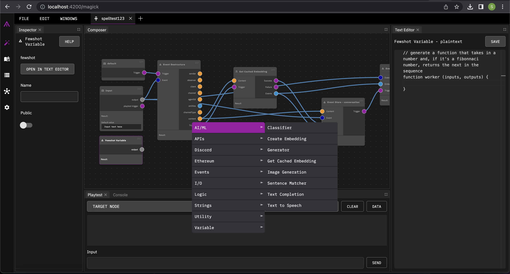
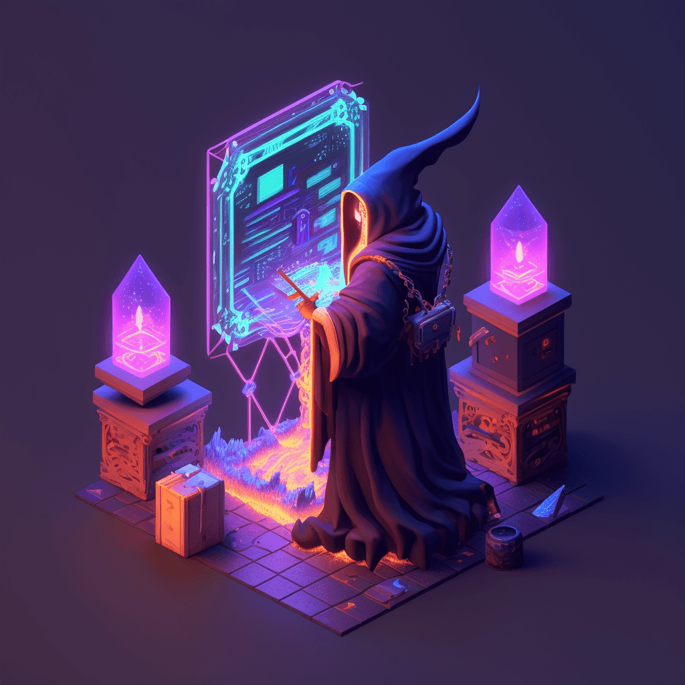

<p align="center"></p>

<p align="center">
  <a href="https://bit.ly/magickdiscordgh">
    
  </a>
  <a href="https://twitter.com/magickml">
    
  </a>
  <a href="https://www.linkedin.com/company/magickml/about/">
    
  </a>
  <a href="https://www.youtube.com/@magickml">
    
  </a>
</p>

<h3 align = "center">Magick is a groundbreaking visual AIDE (Artificial Intelligence Development Environment) for no-code data pipelines and multimodal agents. Magick can connect to other services and comes with nodes and templates well-suited for intelligent agents, chatbots, complex reasoning systems and realistic characters.</h3>

## 🗝 Key Features

- Realtime agents which can perform actions on their own, interact with users and other agents in different modalities with a unified memory and self
- Social connectors to Discord, Twitter and Twilio -- Zoom, Google Meet, Reddit, Slack connectors will be available soon as plugins!
- Search Google, Wikipedia and the Semantic Web
- Many included powertools, including voice and image generation and vector search
- Powerful graph-based IDE for complex data pipelines
- Graphs can be embedded in subgraphs and shared for rapid community development.

## 🔮 Magick: Automate, Build, and Bring Your Ideas to Life with AI.

With Magick, you can unleash the power of AI without needing to know how to code everytbing in a command line interface. Using our visual node based environment, you can connect to popular services and explore a world of pre-built nodes and connectors to bring your vision to life.

<p align="center"></p>

<p align="center">
  <a href="https://www.youtube.com/watch?v=Xy7tMmKluvE" target="_blank">
    
  </a>
  <br />
  ▶️ <strong>Click the image above to watch the <a href="https://www.youtube.com/watch?v=Xy7tMmKluvE" target="_blank">video</a></strong>
</p>

## Core Concepts

### Spells

A spell is a pipeline that describes data moving from one place to another, running through different processes we call "nodes", via wires we call "connections". In Magick, the collection of data, nodes, variables, and presets for each graph is known as a "spell".
Spell is not a machine learning term.

We just like it. Spells can be imported and exported at any time. Spells in their raw form are JSON, a standard format that is easy to share.

### Nodes

**At the core, Magick is a system for taking in data, doing stuff to it, and then sending the final data out.**

This "stuff" is called a "transformation", the data transforms from one thing into the next. The "stuff" that is happening to the data is a black box that takes something in, anything, and returns something out.

We call the black box where the transformstion takes place a "node". Nodes are the building blocks of Magick.

### Creating Nodes

Nodes are created in the composer window of the "Spells" tab. You can right-click in the composer and add nodes from the context menu. You can also drag and drop nodes from the "Nodes" tab into the composer. Nodes can be dragged and dropped around the composer to re-arrange them.

Nodes can be deleted by right-clicking on them and selecting "Delete".

### Node Types

- Input Node
- Prompt Template
- Code Node: Lets you define both inputs and outputs.
- Generator Node: Lets you define your own input sockets and then work with that data inside of the node.
- Wait For All Node: Used to wait for different execution branches to complete before joining back into a single branch -- this is a good way to do several slow tasks at once.
- ...and lots more! (if you have suggestions for any, do let us know)

### Inputs and Outputs

All nodes have some inputs and/or outputs, although they don't necessarily have to have both. Inputs and outputs are visually displayed as sockets. The color of the socket determines the type of data it can receive, with "gray" being the default untyped or "any" type.

### Sockets

Data passed into sockets is available to the node. It can process that data, do something to it, and return the result to the output socket. Some nodes (like Generator node) let you define your own input sockets and then work with that data inside of the node. Some nodes (like the Code node) let you define both inputs and outputs.

### Triggers

Triggers tell nodes to start asynchronous tasks. Some nodes can process data without needing a trigger, but most nodes need triggers. Triggers can be emitted from one socket out to more than one input, however the order of execution is not guaranteed. You can use the "Wait For All" node to wait for different execution branches to complete before joining back into a single branch -- this is a good way to do several slow tasks at once

<hr />

# ⚙️ Installation

## 📚 [Documentation / Guide](https://magick-docs.vercel.app/)

### Prerequisites

Before you start, ensure you have the following software installed on your machine:

- **git**: Version control system, required for cloning the repository.
  - [Download git](https://git-scm.com/downloads)
- **node.js 18+**: JavaScript runtime, needed for running the application.
  - [Download Node.js](https://nodejs.org/en/download/)
- **Docker**: Enables you to run the project within containers for easier setup and distribution.
  - [Download Docker Desktop](https://www.docker.com/products/docker-desktop)

Follow the respective installation guides to set up each piece of software.

- Install **pipx**: A tool for installing and running Python applications in isolated environments.

On Unix and macOS: Open a terminal and run the following command:

```bash
python3 -m pip install --user pipx
python3 -m pipx ensurepath
```

On Windows: Open a command prompt and execute:

```bash
py -m pip install --user pipx
py -m pipx ensurepath
```

Install Poetry (Manages python packages)

```bash
pipx install poetry
```

Verify Installation

```bash
pipx --version
```

Once installed, proceed to set up Magick.

## Setup

Clone and set up Magick

```bash
git clone https://github.com/Oneirocom/Magick
cd Magick
npm install
poetry install --no-root
npm run dev
```

## Run Magick!

```bash
npm run dev
```

Note: Installation is automatic. Most Node projects require `npm install` - With Magick, dependencies will automatically be installed for you. Linux users may need to enter sudo password to install some dependencies.

#### Build

Build will take some time initially. When everything is ready, the client will be ready at [localhost:4200](http://localhost:4200/home)

_Please be aware Magick is under heavy development which may cause breaking changes._

## Database

Magick installs postgres by default. If you want to use a different database, you can change the database connection in the [`.env` file](.env)

## Webhooks

Some connectors (like Github) require webhooks. In development, Magick uses [ngrok](https://ngrok.com/) to create a tunnel to your local machine. You will need to create an account and add your auth token to the [`.env` file](.env)

### Deploy your own Postgres database

To deploy your own database, we suggest using Supabase or another Postgres database. The current setup for events and documents requires the [`pgvector`](https://supabase.com/docs/guides/database/extensions/pgvector) extension to be enabled.

The following documents should help you with setup:

- [Connecting to Postgres](https://supabase.com/docs/guides/database/connecting-to-postgres)
- [OpenAI Embeddings- Postgres Vector](https://supabase.com/blog/openai-embeddings-postgres-vector)

### Initialize a new database

Magick uses [Feathers 5](https://feathersjs.com/) for backend, which in turn uses [Knex](https://knexjs.org/) for making database queries. We will offer a better database configuration experience in the future. For now, you will need to manually configure the database connection in the [`.env` file](.env) and then run the migration script.

```
cd apps/server
npm run migrate
```

## Self signed certificates

Developing locally, it can be very helpful to have google chrome accept all self signed cetificates coming from localhost. To do this, simply paste the following snippet into chromes URL bar and enable the feature:

`chrome://flags/#allow-insecure-localhost`

## Contributors

<!-- ALL-CONTRIBUTORS-BADGE:START - Do not remove or modify this section -->

[](#contributors-)

<!-- ALL-CONTRIBUTORS-BADGE:END -->

<!-- ALL-CONTRIBUTORS-LIST:START - Do not remove or modify this section -->
<!-- prettier-ignore-start -->
<!-- markdownlint-disable -->
<table>
  <tbody>
    <tr>
      <td align="center" valign="top" width="14.28%"><a href="https://github.com/michaelsharpe"><br /><sub><b>Michael</b></sub></a><br /><a href="https://github.com/Oneirocom/Magick/commits?author=michaelsharpe" title="Code">💻</a> <a href="#platform-michaelsharpe" title="Packaging/porting to new platform">📦</a> <a href="#business-michaelsharpe" title="Business development">💼</a></td>
      <td align="center" valign="top" width="14.28%"><a href="https://thenexus.city"><br /><sub><b>M̵̞̗̝̼̅̏̎͝Ȯ̴̝̻̊̃̋̀Õ̷̼͋N̸̩̿͜ ̶̜̠̹̼̩͒</b></sub></a><br /><a href="https://github.com/Oneirocom/Magick/commits?author=lalalune" title="Code">💻</a> <a href="#platform-lalalune" title="Packaging/porting to new platform">📦</a></td>
      <td align="center" valign="top" width="14.28%"><a href="https://github.com/alextitonis"><br /><sub><b>alextitonis</b></sub></a><br /><a href="https://github.com/Oneirocom/Magick/commits?author=alextitonis" title="Code">💻</a></td>
      <td align="center" valign="top" width="14.28%"><a href="http://msub2.com"><br /><sub><b>Daniel Adams</b></sub></a><br /><a href="https://github.com/Oneirocom/Magick/commits?author=msub2" title="Code">💻</a></td>
      <td align="center" valign="top" width="14.28%"><a href="https://3ov.xyz"><br /><sub><b>Anthony Burchell</b></sub></a><br /><a href="https://github.com/Oneirocom/Magick/commits?author=antpb" title="Code">💻</a> <a href="#blog-antpb" title="Blogposts">📝</a></td>
      <td align="center" valign="top" width="14.28%"><a href="https://xrdevlog.com/"><br /><sub><b>jin</b></sub></a><br /><a href="#blog-madjin" title="Blogposts">📝</a></td>
      <td align="center" valign="top" width="14.28%"><a href="https://github.com/sshivaditya2019"><br /><sub><b>Shivaditya Shivganesh</b></sub></a><br /><a href="https://github.com/Oneirocom/Magick/commits?author=sshivaditya2019" title="Code">💻</a></td>
    </tr>
    <tr>
      <td align="center" valign="top" width="14.28%"><a href="https://github.com/khalildh"><br /><sub><b>khalildh</b></sub></a><br /><a href="https://github.com/Oneirocom/Magick/commits?author=khalildh" title="Code">💻</a></td>
      <td align="center" valign="top" width="14.28%"><a href="https://github.com/pigloo"><br /><sub><b>Pigloo</b></sub></a><br /><a href="https://github.com/Oneirocom/Magick/commits?author=pigloo" title="Code">💻</a></td>
      <td align="center" valign="top" width="14.28%"><a href="https://github.com/avirtualfuture"><br /><sub><b>avirtualfuture</b></sub></a><br /><a href="https://github.com/Oneirocom/Magick/commits?author=avirtualfuture" title="Code">💻</a> <a href="https://github.com/Oneirocom/Magick/commits?author=avirtualfuture" title="Documentation">📖</a></td>
      <td align="center" valign="top" width="14.28%"><a href="http://www.alexjorgef.com"><br /><sub><b>Alexandre Ferreira</b></sub></a><br /><a href="https://github.com/Oneirocom/Magick/commits?author=alexjorgef" title="Code">💻</a></td>
      <td align="center" valign="top" width="14.28%"><a href="https://matei3d.com"><br /><sub><b>Matei Anghel</b></sub></a><br /><a href="https://github.com/Oneirocom/Magick/commits?author=matei3d" title="Code">💻</a></td>
      <td align="center" valign="top" width="14.28%"><a href="https://github.com/Trentalantar"><br /><sub><b>Trentalantar</b></sub></a><br /><a href="https://github.com/Oneirocom/Magick/commits?author=Trentalantar" title="Documentation">📖</a></td>
      <td align="center" valign="top" width="14.28%"><a href="https://github.com/DavinciDreams"><br /><sub><b>Lisa Mega Watts</b></sub></a><br /><a href="https://github.com/Oneirocom/Magick/commits?author=DavinciDreams" title="Documentation">📖</a></td>
    </tr>
    <tr>
      <td align="center" valign="top" width="14.28%"><a href="https://github.com/rjphnx"><br /><sub><b>r2</b></sub></a><br /><a href="https://github.com/Oneirocom/Magick/commits?author=rjphnx" title="Documentation">📖</a></td>
      <td align="center" valign="top" width="14.28%"><a href="https://github.com/FabriceIRANKUNDA"><br /><sub><b>IRANKUNDA Fabrice</b></sub></a><br /><a href="https://github.com/Oneirocom/Magick/commits?author=FabriceIRANKUNDA" title="Code">💻</a></td>
      <td align="center" valign="top" width="14.28%"><a href="https://kiennguyensys.blogspot.com/"><br /><sub><b>Kien Nguyen</b></sub></a><br /><a href="https://github.com/Oneirocom/Magick/commits?author=kiennguyensys" title="Code">💻</a></td>
      <td align="center" valign="top" width="14.28%"><a href="https://github.com/BMO-tech"><br /><sub><b>Ben Moore</b></sub></a><br /><a href="https://github.com/Oneirocom/Magick/commits?author=BMO-tech" title="Code">💻</a></td>
      <td align="center" valign="top" width="14.28%"><a href="https://github.com/stackedq"><br /><sub><b>Q</b></sub></a><br /><a href="https://github.com/Oneirocom/Magick/commits?author=stackedq" title="Code">💻</a></td>
      <td align="center" valign="top" width="14.28%"><a href="https://github.com/thomageanderson"><br /><sub><b>thomageanderson</b></sub></a><br /><a href="https://github.com/Oneirocom/Magick/commits?author=thomageanderson" title="Code">💻</a></td>
      <td align="center" valign="top" width="14.28%"><a href="http://palmesi.com"><br /><sub><b>Pietro</b></sub></a><br /><a href="https://github.com/Oneirocom/Magick/commits?author=pizzooid" title="Code">💻</a></td>
    </tr>
    <tr>
      <td align="center" valign="top" width="14.28%"><a href="http://twitter.com/codingsh"><br /><sub><b>codingsh</b></sub></a><br /><a href="https://github.com/Oneirocom/Magick/commits?author=developerfred" title="Code">💻</a></td>
      <td align="center" valign="top" width="14.28%"><a href="https://github.com/benbot"><br /><sub><b>Ben Botwin</b></sub></a><br /><a href="https://github.com/Oneirocom/Magick/commits?author=benbot" title="Code">💻</a> <a href="#platform-benbot" title="Packaging/porting to new platform">📦</a></td>
      <td align="center" valign="top" width="14.28%"><a href="https://chibifire.com"><br /><sub><b>K. S. Ernest (iFire) Lee</b></sub></a><br /><a href="https://github.com/Oneirocom/Magick/commits?author=fire" title="Code">💻</a></td>
      <td align="center" valign="top" width="14.28%"><a href="https://github.com/coffeeorgreentea"><br /><sub><b>coffeeorgreentea</b></sub></a><br /><a href="https://github.com/Oneirocom/Magick/commits?author=coffeeorgreentea" title="Code">💻</a> <a href="#infra-coffeeorgreentea" title="Infrastructure (Hosting, Build-Tools, etc)">🚇</a> <a href="#business-coffeeorgreentea" title="Business development">💼</a></td>
      <td align="center" valign="top" width="14.28%"><a href="https://knar.dev/"><br /><sub><b>Knar</b></sub></a><br /><a href="https://github.com/Oneirocom/Magick/commits?author=Knar33" title="Code">💻</a></td>
      <td align="center" valign="top" width="14.28%"><a href="https://github.com/Emmyn5600"><br /><sub><b>Emmy NSABIMANA </b></sub></a><br /><a href="https://github.com/Oneirocom/Magick/commits?author=emmyn5600" title="Code">💻</a></td>
    </tr>
  </tbody>
</table>

<!-- markdownlint-restore -->
<!-- prettier-ignore-end -->

<!-- ALL-CONTRIBUTORS-LIST:END -->

## Based on Thoth by Latitude Games

The original source code was made by the following contributors to Thoth, which is archived [here](http://github.com/latitudegames/thoth)

<table>
  <tbody>
    <tr>
      <td align="center" valign="top" width="14.28%"><a href="https://github.com/HaruHunab1320"><br /><sub><b>Jakob</b></sub></a><br /><a href="https://github.com/Oneirocom/Magick/commits?author=HaruHunab1320" title="Code">💻</a></td>
      <td align="center" valign="top" width="14.28%"><a href="http://seangillespie.dev"><br /><sub><b>Sean Gillespie</b></sub></a><br /><a href="https://github.com/Oneirocom/Magick/commits?author=seang" title="Code">💻</a></td>
      <td align="center" valign="top" width="14.28%"><a href="https://github.com/michaelsharpe"><br /><sub><b>Michael</b></sub></a><br /><a href="https://github.com/Oneirocom/Magick/commits?author=michaelsharpe" title="Code">💻</a></td>
      <td align="center" valign="top" width="14.28%"><a href="http://prestongull.com"><br /><sub><b>Preston Gull</b></sub></a><br /><a href="https://github.com/Oneirocom/Magick/commits?author=pgull" title="Code">💻</a><a href="https://github.com/Oneirocom/Magick/commits?author=pgull" title="Design">🎨</a></td>
      <td align="center" valign="top" width="14.28%"><a href="https://github.com/nickwalton"><br /><sub><b>Nick Walton</b></sub></a><br /><a href="https://github.com/Oneirocom/Magick/commits?author=nickwalton" title="Code">💻</a></td>
      <td align="center" valign="top" width="14.28%"><a href="https://github.com/mitchellgordon95"><br /><sub><b>Mitchell Gordon</b></sub></a><br /><a href="https://github.com/Oneirocom/Magick/commits?author=mitchellgordon95" title="Code">💻</a></td>
      <td align="center" valign="top" width="14.28%"><a href="http://generative.ink"><br /><sub><b>?/janus</b></sub></a><br /><a href="https://github.com/Oneirocom/Magick/commits?author=socketteer" title="Code">💻</a></td>
      <td align="center" valign="top" width="14.28%"><a href="https://github.com/aawalton"><br /><sub><b>Alan Walton</b></sub></a><br /><a href="https://github.com/Oneirocom/Magick/commits?author=aawalton" title="Code">💻</a></td>
    </tr>
  </tbody>
</table>

# Come Build With Us!

We are building Magick as a community in the open on Discord. If you are interested in contributing to the project, we'd love to have you.

Join us here: https://bit.ly/magickdiscordgh

<p align="center"></p>
