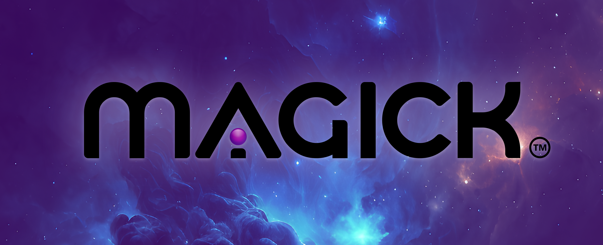

<p align="center"></p>

<h1 align="center">MAGICK</h1>

[](https://discord.gg/magickml)


Magick is a visual IDE for no-code data pipelines and multimodal agents. Magick can connect to other services and comes with nodes and connectors well-suited for intelligent agents, chatbots, complex reasoning systems and realistic characters.

## Key Features

- Powerful graph-based IDE for complex data pipelines
- Realtime agents which can perform actions on their own, interact with users and other agents in different modalities with a unified memory and self
- Social connectors to Discord, Twitter and Twilio -- Zoom, Google Meet, Reddit, Slack connectors will be available soon as plugins!
- Search Google, Wikipedia and the Semantic Web
- Many included powertools, including voice and image generation and vector search
- Graphs can be embedded in subgraphs and shared for rapid community development

`Powerful enough for wizards. Easy enough for mere mortals.`

## Documentation is [Here](https://magick-docs.vercel.app/)

<p align="center"></p>

### Setup

First, clone and set up Magick

```
git clone https://github.com/Oneirocom/Magick
cd Magick
```

# Run Magick!

```
npm run dev
```
Note: Most Node projects require `npm install` - With Magick, dependencies will automatically be installed for you

# Development

There are a few things to keep in mind while this project is actively being worked on.

## Database

### Local Sqlite (default)

> NOTE: If you're using Microsoft Windows, required sqlite extensions won't work, please use `postgres`.

Simply add a relative or absolute path to your sqlite file in the `.env`, run `npm run migrate`.

#### NOTE: 
  There are two sqlite extensions used, `sqlite-vector` and `sqlite-vss`

  based on the [docs](https://github.com/asg017/sqlite-vss#documentation),
  on Linux machines, you'll have to install some packages to make it work:

  ```
    sudo apt-get update
    sudo apt-get install -y libgomp1 libatlas-base-dev liblapack-dev 
  ```

  No extra steps for MacOS.

### Supabase public database 

_Please be aware Magick is under heavy development and changes can cause your DB to be wiped. Back up your spells via export regularly._

Magick can connect to a test database on Supabase. It will get you going, but it will likely be wiped regularly and is not a good storage for your spells.

just enable the pg database in the `.env` file.

### Deploy your own database

To deploy your own database, we suggest using Supabase or another Postgres database. The current setup for events and documents requires the `pgvector` extension to be enabled.

The following documents should help you with setup:
- https://supabase.com/docs/guides/database/connecting-to-postgres
- https://supabase.com/blog/openai-embeddings-postgres-vector

To initialize a new database, you will probably need to call migrate. Magick uses Feathers 5 for backend, which in turn uses Knex for making database queries. To migrate the database, cd to apps/server and run `npm run migrate`. 

You will need to change the `connection` property in feathers config. We will offer a better database configuration experience in the future, for now we suggest find and replacing any URLs that point to the database (ctrl f `postgresql://`)

## Self signed certificates

Developing locally, it can be very helpful to have google chrome accept all self signed cetificates coming from localhost. To do this, simply paste the following snippet into chromes URL bar and enable the feature:

`chrome://flags/#allow-insecure-localhost`

## Contributors
<!-- ALL-CONTRIBUTORS-BADGE:START - Do not remove or modify this section -->
[](#contributors-)
<!-- ALL-CONTRIBUTORS-BADGE:END -->

<!-- ALL-CONTRIBUTORS-LIST:START - Do not remove or modify this section -->
<!-- prettier-ignore-start -->
<!-- markdownlint-disable -->
<table>
  <tbody>
    <tr>
      <td align="center" valign="top" width="14.28%"><a href="https://github.com/michaelsharpe"><br /><sub><b>Michael</b></sub></a><br /><a href="https://github.com/Oneirocom/Magick/commits?author=michaelsharpe" title="Code">💻</a> <a href="#platform-michaelsharpe" title="Packaging/porting to new platform">📦</a> <a href="#business-michaelsharpe" title="Business development">💼</a></td>
      <td align="center" valign="top" width="14.28%"><a href="https://thenexus.city"><br /><sub><b>M̵̞̗̝̼̅̏̎͝Ȯ̴̝̻̊̃̋̀Õ̷̼͋N̸̩̿͜ ̶̜̠̹̼̩͒</b></sub></a><br /><a href="https://github.com/Oneirocom/Magick/commits?author=lalalune" title="Code">💻</a> <a href="#platform-lalalune" title="Packaging/porting to new platform">📦</a></td>
      <td align="center" valign="top" width="14.28%"><a href="https://github.com/alextitonis"><br /><sub><b>alextitonis</b></sub></a><br /><a href="https://github.com/Oneirocom/Magick/commits?author=alextitonis" title="Code">💻</a></td>
      <td align="center" valign="top" width="14.28%"><a href="http://msub2.com"><br /><sub><b>Daniel Adams</b></sub></a><br /><a href="https://github.com/Oneirocom/Magick/commits?author=msub2" title="Code">💻</a></td>
      <td align="center" valign="top" width="14.28%"><a href="https://3ov.xyz"><br /><sub><b>Anthony Burchell</b></sub></a><br /><a href="https://github.com/Oneirocom/Magick/commits?author=antpb" title="Code">💻</a> <a href="#blog-antpb" title="Blogposts">📝</a></td>
      <td align="center" valign="top" width="14.28%"><a href="https://xrdevlog.com/"><br /><sub><b>jin</b></sub></a><br /><a href="#blog-madjin" title="Blogposts">📝</a></td>
      <td align="center" valign="top" width="14.28%"><a href="https://github.com/sshivaditya2019"><br /><sub><b>Shivaditya Shivganesh</b></sub></a><br /><a href="https://github.com/Oneirocom/Magick/commits?author=sshivaditya2019" title="Code">💻</a></td>
    </tr>
    <tr>
      <td align="center" valign="top" width="14.28%"><a href="https://github.com/khalildh"><br /><sub><b>khalildh</b></sub></a><br /><a href="https://github.com/Oneirocom/Magick/commits?author=khalildh" title="Code">💻</a></td>
      <td align="center" valign="top" width="14.28%"><a href="https://github.com/pigloo"><br /><sub><b>Pigloo</b></sub></a><br /><a href="https://github.com/Oneirocom/Magick/commits?author=pigloo" title="Code">💻</a></td>
      <td align="center" valign="top" width="14.28%"><a href="https://github.com/avirtualfuture"><br /><sub><b>avirtualfuture</b></sub></a><br /><a href="https://github.com/Oneirocom/Magick/commits?author=avirtualfuture" title="Code">💻</a></td>
      <td align="center" valign="top" width="14.28%"><a href="http://www.alexjorgef.com"><br /><sub><b>Alexandre Ferreira</b></sub></a><br /><a href="https://github.com/Oneirocom/Magick/commits?author=alexjorgef" title="Code">💻</a></td>
      <td align="center" valign="top" width="14.28%"><a href="https://matei3d.com"><br /><sub><b>Matei Anghel</b></sub></a><br /><a href="https://github.com/Oneirocom/Magick/commits?author=matei3d" title="Code">💻</a></td>
    </tr>
  </tbody>
</table>

<!-- markdownlint-restore -->
<!-- prettier-ignore-end -->

<!-- ALL-CONTRIBUTORS-LIST:END -->

## Based on Thoth by Latitude Games
The original source code was made by the following contributors to Thoth, which is archived [here](http://github.com/latitudegames/thoth)

<table>
  <tbody>
    <tr>
      <td align="center" valign="top" width="14.28%"><a href="https://github.com/HaruHunab1320"><br /><sub><b>Jakob</b></sub></a><br /><a href="https://github.com/Oneirocom/Magick/commits?author=HaruHunab1320" title="Code">💻</a></td>
      <td align="center" valign="top" width="14.28%"><a href="http://seangillespie.dev"><br /><sub><b>Sean Gillespie</b></sub></a><br /><a href="https://github.com/Oneirocom/Magick/commits?author=seang" title="Code">💻</a></td>
      <td align="center" valign="top" width="14.28%"><a href="https://github.com/michaelsharpe"><br /><sub><b>Michael</b></sub></a><br /><a href="https://github.com/Oneirocom/Magick/commits?author=michaelsharpe" title="Code">💻</a></td>
      <td align="center" valign="top" width="14.28%"><a href="http://prestongull.com"><br /><sub><b>Preston Gull</b></sub></a><br /><a href="https://github.com/Oneirocom/Magick/commits?author=pgull" title="Code">💻</a><a href="https://github.com/Oneirocom/Magick/commits?author=pgull" title="Design">🎨</a></td>
      <td align="center" valign="top" width="14.28%"><a href="https://github.com/nickwalton"><br /><sub><b>Nick Walton</b></sub></a><br /><a href="https://github.com/Oneirocom/Magick/commits?author=nickwalton" title="Code">💻</a></td>
      <td align="center" valign="top" width="14.28%"><a href="https://github.com/mitchellgordon95"><br /><sub><b>Mitchell Gordon</b></sub></a><br /><a href="https://github.com/Oneirocom/Magick/commits?author=mitchellgordon95" title="Code">💻</a></td>
      <td align="center" valign="top" width="14.28%"><a href="http://generative.ink"><br /><sub><b>?/janus</b></sub></a><br /><a href="https://github.com/Oneirocom/Magick/commits?author=socketteer" title="Code">💻</a></td>
      <td align="center" valign="top" width="14.28%"><a href="https://github.com/aawalton"><br /><sub><b>Alan Walton</b></sub></a><br /><a href="https://github.com/Oneirocom/Magick/commits?author=aawalton" title="Code">💻</a></td>
    </tr>
  </tbody>
</table>

# Come Build With Us!
We are building Magick as a community in the open on Discord. If you are interested in contributing to the project, we'd love to have you.

Join us here: https://discord.gg/magickml

<p align="center"></p>
