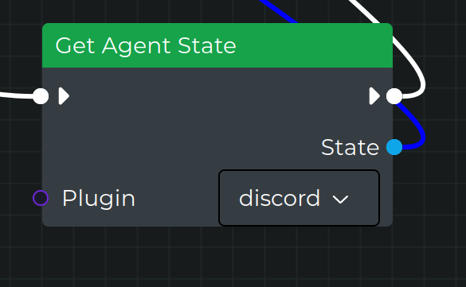
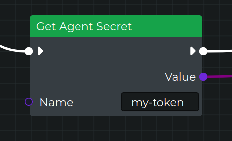
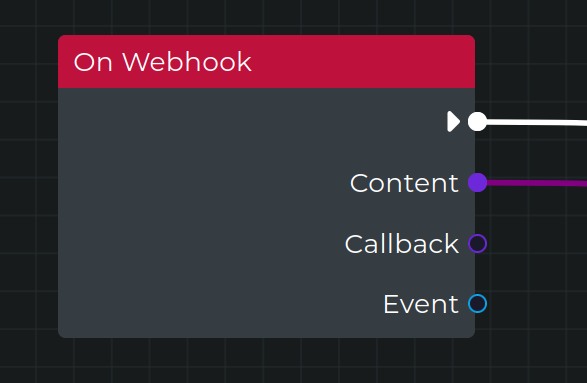

# Dev Log 1: Plugin Things

## Plugin Commands

Plugin commands can be setup and registered similar to dependencies/actions and events.
We have some base ones setup, but each plugin can register its own specific ones.

#### Configuration

```typescript
// config/commands.ts
import { type PluginCommandInfo } from 'server/plugin'
import { basePluginCommands } from 'server/plugin'

const customCommand: PluginCommandInfo = {
  commandName: 'customCommand',
  displayName: 'Custom Command',
}

export const myPluginCommands: Record<string, PluginCommandInfo> = {
  // basePluginCommands has enable/disable/linkCredential/unlinkCredential/webhook
  ...basePluginCommands,
  customCommand,
}
```

#### Setup

```typescript
// in main plugin file ex corePlugin.ts

// this is an abstract implementation and will get called in BasePlugin's init()
defineCommands() {
	const { enable, disable, linkCredential, unlinkCredential } =
	basePluginCommands
	this.registerCommand({
		...linkCredential,
		handler: this.handleEnable.bind(this),
	})
	this.registerCommand({
		...unlinkCredential,
		handler: this.handleDisable.bind(this),
	})

	this.registerCommand({ ...enable, handler: this.handleEnable.bind(this) })

	this.registerCommand({ ...disable, handler: this.handleDisable.bind(this) })
}

// define your handlers
async handleEnable() {} // ...

```

#### Usage

```typescript
// anywhere else in the application
const command: AgentCommandData = {
  agentId,
  command: `plugin:${pluginName}:linkCredential`,
  data: {
    credential: 'my-plugins-token',
  },
}

await app.get('agentCommander').command(command)
```

## Plugin State

Plugins now have a way to have state that persists and a manager for it: `plugin-state-manager.ts`. There are some helpers for it in the BasePlugin class.

It's a core piece for handling the flow decision on things like "should this plugin enable" and "what types of messages should i listen to". It's also a good place to store things gathered on bootup such as the username from discord/slack, or the custom models available from an openai key.

Combining this with commands, plugins now have the ability to manage their own dynamic config.

The corePlugin now has a node called `getPluginState`, which lets you retrieve the state object of one or all plugins.

#### Schema

```prisma
// in prisma.schema
model pluginState {
	id String @id @default(dbgenerated("uuid_generate_v4()")) @db.Uuid
	agentId String? @db.Uuid
	state Json? @db.Json
	plugin String? @db.VarChar(255)
	agents agents? @relation(fields: [agentId], references: [id], onDelete: Cascade, onUpdate: NoAction, map: "pluginstate_agentid_foreign")

	@@unique([agentId, plugin], map: "pluginstate_agentid_plugin_unique")
	@@schema("public")
}
```

#### Configuration

```typescript
// in config/state.ts
import type { PluginStateType } from 'plugin-state'

// setup context with username from platofrm (ex: discord bot' username)
export type MyAgentContext = {
  username: string | undefined
}

export interface MyPluginState extends PluginStateType {
  enabled: boolean
  context: CoreAgentContext
}

export const myDefaultState: CorePluginState = {
  enabled: true,
  context: {
    username: '',
  },
}
```

#### Setup & Usage

```typescript
// in main yourPlugin.ts file
export class MyPlugin extends CoreEventsPlugin<
  CorePluginEvents,
  EventPayload,
  Record<string, unknown>,
  Record<string, unknown>,
  MyPluginState, // Make sure to pass the type here so that we have a typesafety
  MyPluginCredentials
> {
  override defaultState = myDefaultState // Make sure to override the state

  // Updating the enabled state of a plugin, good to bind to a command
  async handleEnable() {
    // does not overwrite the other keys just new values, see the plugin-state-manager.ts.
    await this.updatePluginState({ enabled: true } as State)
    await this.initializeFunctionalities()
  }

  // Updating the our plugin specific context in state
  async updateContext() {
    const context = await this.getContext()
    await this.updatePluginState({ context } as Partial<State>)
  }

  // exmaple method of getting context, in this case the discord bot's username
  getContext() {
    const user = this.discord.user
    return {
      username: this.discord.user?.username,
    }
  }
}
```



## Plugin Credentials

Plugins now have a much better credentials experience. The original credentials manager is still there unchanged for the `/credentials` endpoint, but now plugins get their own `plugin-credentials-manager.ts`. Following the plugin-state-manager pattern, the credentials live in the manager which helps simplify things. There are some helpers for it in the BasePlugin class.

We also have a new node, `getSecret` that lets users pull in custom, (and only custom), secrets that are linked to their agent. I'd like to populate the dropdown with their available secrets if feasible.

#### Configuration

```typescript
// in config/credentials.ts
import { type ExtractPluginCredentialNames, type PluginCredential } from 'packages/server/credentials/src'
import { discordPluginName } from './constants'

export const discordPluginCredentials = [
  {
    name: 'discord-token',
    serviceType: 'discord',
    credentialType: 'plugin',
    initials: 'DC',
    clientName: 'Discord Token',
    icon: 'https://discord.com/assets/f8389ca1a741a115313bede9ac02e2c0.svg',
    helpLink: 'https://discord.com/developers/applications',
    description: 'Used to connect to Discord',
    available: true,
    pluginName: discordPluginName,
  },
] as const satisfies ReadonlyArray<PluginCredential> // make sure have this part

export type DiscordCredentialNames = ExtractPluginCredentialNames<typeof discordPluginCredentials>

export type DiscordCredentialsKeys = {
  [K in DiscordCredentialNames]: string | undefined
}

export type DiscordCredentials = Record<DiscordCredentialNames, string | undefined>
```

#### Setup

```typescript
export class DiscordPlugin extends CoreEventsPlugin<
CorePluginEvents,
EventPayload,
Record<string, unknown>,
Record<string, unknown>,
DiscordPluginState,
DiscordCredentials // make sure to pass in here so you have typesafety
< {
	credentials = corePluginCredentials // set this as a constant
	...
}
```

#### Usage

```typescript
// these methods are in BasePlugin.ts and can be used in your MyPlugin.ts file

// this will get all credentials for the plugin if they exist, getting them first if needed
async getCredentials() {
  return this.credentialsManager.getCredentials()
}

// this will get a specific credential for the plugin if it exists, fetching it first if needed
async getCredential(name: keyof Credentials) {
  return this.credentialsManager.getCredential(name)
}

// this will get a fresh copy always
async updateCredentials() {
  await this.credentialsManager.update()
}

// Usage
const creds = await this.getCredentials()
const token = getCredential('discord-token')
await updateCredentials()

// you can also access it directly
this.credentialsManager.someMethod()

```



## Plugin WebHooks

Most things we want to integrate events from will do so via WebHooks, something plugins can't do by themselves. I found the best entry point was to create a relay for it via an endpoint and plugin commands.

And so there is a `/webhook` endpoint setup. For simplicity's sake this is done in the feathers server, but I think this would be better as a 'catchall single route' express/fastify app or portal endpoint. Anywhere serverless and seperate really (gcp cloudrun would be good). That way if some noob misconfigures their zapier integration our main server wont be spammed.

```typescript
// services/webhook-service.ts

// service
class WebhookService implements WebhookServiceMethods {
  app: Application

  // ...
  async create(data: BasePayload, params?: Params): Promise<unknown> {
    // ...
    const command: AgentCommandData = {
      agentId,
      command: `plugin:${pluginName}:webhook`,
      data,
    }

    await this.app.get('agentCommander').command(command)

    // ...
  }
}

// register
export const webhook = (app: Application): void => {
  app.use('/webhook/:agentid/:plugin', new WebhookService({}, app)),
    {
      methods: ['create'],
    }
}

//
```

It takes incoming requests from arbitrary services and routes them to the correct agent via sending a `webhook` plugin command with a payload like:
`{ service: ${nameOfService} }`

Validation and handling of the payload (ex: signing-secrets) is to be implemented in the plugin by binding and handler to the command.

The baseCommands have been updated to include the webhook, but should be extended with the correct type. Here is how you would want your plugins webhook.ts to look like:

```typescript
import { EventPayload, WebhookPayload } from 'server/plugin'
import { corePluginName } from './constants'

type ValidPayload = {
  content: string
  callback?: string
}
export type CoreWebhookPayload = WebhookPayload<ValidPayload>['payload']

export const validateCoreWebhookPayload = (payload: unknown): payload is ValidPayload => {
  return true
}

export type CoreWebhookEventPayload = EventPayload<ValidPayload, Record<string, unknown>>
```

The above example is from the core plugin and is used to setup the new `onWebhook` event node. This event node is triggered by a 'webhookReceived' event like so:

```bash
curl -
  X POST
  "http://localhost:3030/webhook/ae9a88d2-d502-4e5d-8599-f778c1025ab0/core" -
  H "Content-Type: application/json" - d '{"content":"hello"}'
{
"content":"hello"}

```
If your plugin was a integrating a third party via webhooks you would then use CoreWebhookEventPayload anywhere you would use EventPayload.

I think abstacting some of this handling into BasePlugin would be a good idea, but for now you can see the implementation in the core plugin.



## New Plugin Abstraction
Named `WebSocketPlugin` at the moment, is a abstraction over CoreEventsPlugin that standardizes/simplifies the logic of discord/slack like plugins. I'm not going to go into much detail, because the file itself is well documented so take a look!
It abstracts away much of:

- credential management/refreshing/validation
- state management
- responding to commands
- logging in/out
- listening to events

Which turns the actual Slack and Discord plugins into mostly config, type definitions and the actual nodes.


##  
##  
Note: I haven't fully integrated all of these features into the core plugin yet beyond updating what needed to be and setting up its creds/state/commands files. I've spent the least amount of time in the core plugin, so you guys would know best but i believe there's a lot of things here it can take advantage from via usage/more abstraction. For example we can simplify and outright remove much of the credentials logic from their now, etc.
